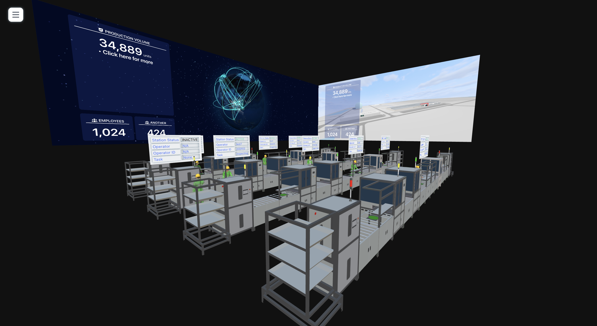

# Stream Of Quality (SOQ) - 3 Dimension

This project uses vanila js and light weight three js to load model 3 dimension model(s) of manufacture line.
improve version includes motion caption of 3d charactors
## Motivation

This project will allow one get basic information from production line (in 3D). As well as display the action of 
an employee will be doing.

## Code Style

This project uses both Object Oriented Programming (OOP) and Functional Programming to organized unit codes

## webserver should look like




## Build Structure

```
.
├── README.md
├── css
│   └── style.css
├── index.html
├── jasonFiles
│   ├── FoxconnFactories.json
│   ├── FoxconnLighthouseFactories.json
│   ├── GlobeData.json
│   ├── LocalCampusData.json
│   └── WorkersData.json
├── package-lock.json
├── package.json
├── public
│   ├── GLBModels
│   │   ├── EmployeePoses
│   │   │   ├── carryingPoseDraco.glb
│   │   │   ├── grabPoseDraco.glb
│   │   │   ├── operatingAnimationV2.glb
│   │   │   └── workingPoseDraco.glb
│   │   └── Machines
│   │       ├── cartStacker.glb
│   │       ├── dracoAOI.glb
│   │       ├── dracoConveyorV2.glb
│   │       ├── dracoFanDim.glb
│   │       ├── dracoLeftLoader.glb
│   │       ├── dracoLoader.glb
│   │       ├── dracoManaulConveyorV2.glb
│   │       ├── productiobLines-withWorkersV2.glb
│   │       └── production-lines.glb
│   ├── assets
│   │   ├── img
│   │   │   ├── 1c45465e.png
│   │   │   ├── 280f82f7.png
│   │   │   ├── 50c63ef1.png
│   │   │   ├── 5a75c5cc.png
│   │   │   ├── 6d032c97.png
│   │   │   ├── 8efea0d6.png
│   │   │   ├── 920fe7ee.png
│   │   │   ├── 9717559b.png
│   │   │   ├── 97ab87cd.png
│   │   │   ├── 9abf1803.png
│   │   │   ├── a3b7a86f.png
│   │   │   ├── earth-blue-marble.jpg
│   │   │   ├── earth-dark.jpg
│   │   │   ├── earth-day.jpg
│   │   │   ├── earth-night.jpg
│   │   │   ├── earth-topology.png
│   │   │   ├── earth-water.png
│   │   │   ├── earth_aperture.png
│   │   │   ├── earth_texture_map.jpg
│   │   │   ├── fc3626a1.png
│   │   │   ├── globalView.png
│   │   │   ├── lineView.png
│   │   │   ├── marker.png
│   │   │   ├── marker.svg
│   │   │   ├── markerWhite.png
│   │   │   ├── markerWhite.svg
│   │   │   ├── night-sky.png
│   │   │   ├── parkView.png
│   │   │   ├── satelite-orbit.png
│   │   │   ├── satelite-orbit.svg
│   │   │   ├── sp2.png
│   │   │   ├── wave.png
│   │   │   ├── wave.png.svg
│   │   │   └── world.svg
│   │   ├── sky
│   │   │   ├── back.jpeg
│   │   │   ├── bottom.jpeg
│   │   │   ├── front.jpeg
│   │   │   ├── left.jpeg
│   │   │   ├── right.jpeg
│   │   │   └── top.jpeg
│   │   └── stations
│   │       ├── AOI.svg
│   │       ├── dimm-fan.svg
│   │       ├── lift.svg
│   │       └── manual.svg
│   ├── build
│   │   ├── campusChart.js
│   │   ├── css
│   │   │   └── style.css
│   │   ├── globe.js
│   │   ├── localCampus.js
│   │   └── minChart.js
│   ├── jasonFiles
│   │   ├── FoxconnFactories.json
│   │   ├── FoxconnLighthouseFactories.json
│   │   ├── GlobeData.json
│   │   ├── LocalCampusData.json
│   │   └── WorkersData.json
│   ├── navigation-pages
│   │   ├── global.html
│   │   ├── local-campus.html
│   │   ├── test-page-2.html
│   │   └── test-page.html
│   ├── parkModel
│   │   ├── 868.png
│   │   ├── Cube_001_png.png
│   │   ├── Sphere.png
│   │   ├── datacenter-body.png
│   │   ├── mpb.png
│   │   ├── park.bin
│   │   ├── park.gltf
│   │   ├── parkImg
│   │   │   └── light-flow-v1.PNG
│   │   └── smc.png
│   └── static
│       ├── draco_decoder.js
│       ├── draco_decoder.wasm
│       ├── draco_encoder.js
│       └── draco_wasm_wrapper.js
├── src
│   ├── PlatForms
│   │   ├── components
│   │   │   ├── Display.js
│   │   │   ├── InitWorker.js
│   │   │   ├── camera.js
│   │   │   ├── endToEnd.js
│   │   │   ├── light.js
│   │   │   ├── main.js
│   │   │   └── scene.js
│   │   ├── models
│   │   │   ├── model.js
│   │   │   └── setUp.js
│   │   └── systemControls
│   │       ├── Control.js
│   │       ├── Loop.js
│   │       ├── Renderer.js
│   │       └── Resizer.js
│   └── jsFiles
│       ├── ClickAndHold.js
│       ├── GuiController.js
│       ├── backWallGlobe.js
│       ├── campusChart.js
│       ├── globe.js
│       ├── localCampus.js
│       ├── minChart.js
│       └── sideWallCampus.js
├── style.css
└── tailwind.config.js

```
## Environment setup with new project
Install with npm

```bash
  npm install @vitejs/app
    - choose vanilla js
    - rename <project-name>
  cd <project-name>
  npm install
  npm run dev
```
## clone repo
```sh
git clone git@gitlab.com:foxconn-iai-soq/soq-3d.git
```
- npm install for dependencies
- npm run dev for running the development environment
    
## Git help

 - [More git commands](https://confluence.atlassian.com/bitbucketserver/basic-git-commands-776639767.html)

## Sources

- [TechBackground](https://www.shutterstock.com/search/hi+tech+show)
- [THREE JS](https://threejs.org/)
- [dat gui](https://github.com/dataarts/dat.gui)
- [three js textBook and codes examples](https://discoverthreejs.com/book/first-steps/load-models/)