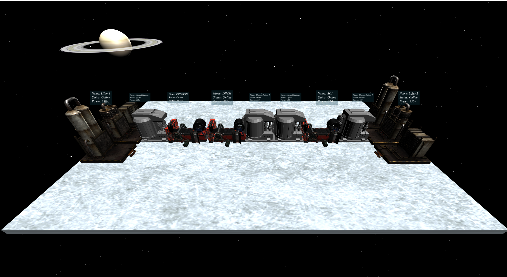

# Stream Of Quality (SOQ) - 3 Dimension

This project uses vanila js and light weight three js to load model 3 dimension model(s) of manufacture line.


## Motivation

This project will allow one get basic information from production and the model that mimic the production line (in 3D). 

## Code Style

This project uses both Object Oriented Programming (OOP) and Functional Programming to organized unit codes

## webserver should look like




## Build Structure

```
.
├── README.md
├── dist
│   ├── assets
│   │   ├── favicon.17e50649.svg
│   │   ├── index.dba200dc.js
│   │   └── vendor.c1d2e270.js
│   └── index.html
├── examples
│   ├── UpdatedScreen.png
│   ├── lookLike.png
│   └── updatedLambo.png
├── favicon.svg
├── index.html
├── main.js
├── package-lock.json
├── package.json
├── rollup.config.js
├── src
│   ├── Display.js
│   ├── LoadSrc
│   │   └── srcFiles.js
│   ├── TestFile.js
│   ├── cloneMain.js
│   ├── importedModels
│   │   ├── factory_machine
│   │   │   ├── license.txt
│   │   │   ├── scene.bin
│   │   │   ├── scene.gltf
│   │   │   └── textures
│   │   ├── factory_machine_noColor
│   │   │   ├── scene.bin
│   │   │   └── scene.gltf
│   │   ├── license.txt
│   │   ├── model.gltf
│   │   ├── old_oil_tank_.2
│   │   │   ├── scene.bin
│   │   │   ├── scene.gltf
│   │   │   └── textures
│   │   ├── scene.bin
│   │   ├── screenBackground
│   │   │   ├── NormalMap.png
│   │   │   ├── floorMetal.jpeg
│   │   │   ├── metalMapping.jpeg
│   │   │   └── techBackground.jpg
│   │   └── textures
│   │       ├── CENTENARIO_baseColor.jpeg
│   │       ├── CRBN_JANTE_baseColor.jpeg
│   │       ├── CUIR.001_baseColor.jpeg
│   │       ├── Material.003_baseColor.jpeg
│   │       ├── PLAS_baseColor.jpeg
│   │       └── material_0_baseColor.jpeg
│   ├── plateForm
│   │   ├── components
│   │   │   ├── CreatePlanets.js
│   │   │   ├── camera.js
│   │   │   ├── light.js
│   │   │   └── scene.js
│   │   ├── models
│   │   │   ├── LineGenerator.js
│   │   │   ├── model.js
│   │   │   ├── plane.js
│   │   │   └── setUp.js
│   │   └── systemControls
│   │       ├── Control.js
│   │       ├── Loop.js
│   │       ├── Renderer.js
│   │       ├── Resizer.js
│   │       └── TransformControl.js
│   └── simpleMain.js
└── style.css


```
## Environment setup with new project
Install with npm

```bash
  npm install @vitejs/app
    - choose vanilla js
    - rename <project-name>
  cd <project-name>
  npm install
  npm run dev
  in <project-name>
    - npm install --save three
    - npm install --save dat
```
## clone repo
```sh
git clone git@gitlab.com:foxconn-iai-soq/soq-3d.git
```
- npm install for dependencies
    
## Git help

 - [More git commands](https://confluence.atlassian.com/bitbucketserver/basic-git-commands-776639767.html)

## Sources

- [TechBackground](https://www.shutterstock.com/search/hi+tech+show)
- [THREE JS](https://threejs.org/)
- [dat gui](https://github.com/dataarts/dat.gui)
- [three js textBook and codes examples](https://discoverthreejs.com/book/first-steps/load-models/)